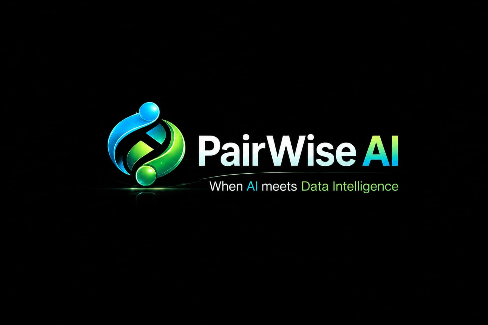

<div align="center">



# 🤖 PairWise AI
### Intelligent Candidate Discovery & Ranking System


> **Team PairWise AI** | Hack2Skill × Redrob | India Runs Hackathon 2026

</div>

---

## 🎯 Problem Statement
Recruiters spend **60–80% of their time** manually screening resumes.
PairWise AI automates intelligent candidate discovery and ranking
using semantic similarity and multi-factor scoring — cutting screening
time by up to 70%.

---

## 🧠 How It Works

1. **Parse** — Extract structured data from resumes & job descriptions
2. **Embed** — Convert text to semantic vectors (Sentence Transformers)
3. **Rank** — Score candidates using cosine similarity + weighted factors
4. **Visualize** — Interactive dashboard for recruiter insights

---

## ⚙️ Tech Stack

| Layer | Technology |
|---|---|
| Embeddings | `sentence-transformers` |
| ML | `scikit-learn` |
| Backend | `FastAPI` |
| Frontend | `Streamlit` |
| Visualization | `Plotly` |
| Data | `Pandas`, `NumPy` |

---

## 📁 Project Structure

```

pairwise-ai/
├── app/                  # Streamlit dashboard
├── src/                  # Core pipeline
│   ├── parser.py         # Resume & JD parsing
│   ├── embedder.py       # Sentence Transformer embeddings
│   ├── ranker.py         # Candidate scoring & ranking
│   └── utils.py          # Shared helpers
├── data/
│   ├── raw/              # Hack2Skill dataset
│   ├── processed/        # Cleaned data
│   └── sample/           # Synthetic data for testing
├── notebook/             # EDA & experiments
├── docs/                 # Architecture & demo docs
└── requirements.txt
```

---

## 🚀 Quick Start

```bash
git clone https://github.com/tjsafi9/PairWise-Ai.git
cd PairWise-Ai
pip install -r requirements.txt
streamlit run app/streamlit_app.py
```

---

## 👥 Team PairWise AI

| Name | Role | Degree |
|---|---|---|
| Thaslim M | AI/ML Pipeline & Embeddings | BSc AIML (Final Year) |
| Mohammed Safi TJ | Data Analysis & Visualization | BSc Data Science |

---

## 📌 Hackathon Details

| | |
|---|---|
| **Event** | India Runs Hackathon 2026 |
| **Organizer** | Hack2Skill × Redrob |
| **Track** | 01 — Data & AI Challenge |
| **Challenge** | Intelligent Candidate Discovery & Ranking |
| **Deadline** | July 2, 2026 |
```

---